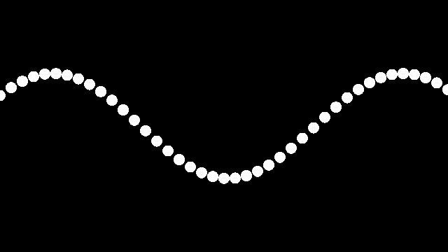

easygraphics.processing package
===============================
A Processing (http://processing.org) like animation graphics module

.. code-block:: python

    from easygraphics import *
    from easygraphics.processing import *
    import math

    x_spacing = 16  # How far apart should each horizontal location be spaced
    theta = 0  # Start angle at 0
    amplitude = 75  # Height of wave
    period = 500  # How many pixels before the wave repeats

    dx = (2 * math.pi / period) * x_spacing

    def setup():
        global w
        set_size(640, 360)
        translate(0, get_height() // 2)
        set_background_color("black")
        set_fill_color("white")
        w = get_width() + 16  # Width of entire wave

    def draw():
        global theta
        theta += 0.02
        clear_device()
        x = theta
        for i in range(w // x_spacing):
            y = math.sin(x) * amplitude
            fill_circle(i * x_spacing, y, 8)
            x += dx

    run_app(globals())

Function list
-------------

.. currentmodule:: easygraphics.processing

Main App
^^^^^^^^
.. autosummary::

    run_app

To be redefined(Override)
^^^^^^^^^^^^^^^^^^^^^^^^^
.. autosummary::

    draw
    setup
    on_mouse_clicked
    on_mouse_dragged
    on_mouse_pressed
    on_mouse_released
    on_mouse_wheel

Control and Settings
^^^^^^^^^^^^^^^^^^^^
.. autosummary::

    full_screen
    get_frame_rate
    loop
    mouse_pressed
    mouse_x
    mouse_y
    noloop
    prev_mouse_x
    prev_mouse_y
    redraw
    set_frame_rate
    set_size

Functions
---------
.. automodule:: easygraphics.processing
    :members:
    :undoc-members:
