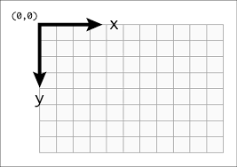

The First Drawing
=================

Let\'s draw a line from (0,0) to (640,480)

In computer graphics, we normally use a screen coordinate system as below:

In this system, the origin (0,0) is at screen\'s upper left corner, and y-axis is growing top-down.

So the result is a line from upper left corner to lower right corner.

.. code-block:: python

    from easygraphics import *

    def main():
        init_graph(640, 480)
        line(0, 0, 640, 480)
        pause()
        close_graph()

    easy_run(main)