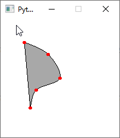

Drawing a Shape using Vertices
==============================

We can use vertices to draw complex shapes.

The following code draws a star.

**Note**:

* We use a for loop to define 5 vertices of the star.

* We set end_shape()'s parameter to True to draw a closed polyline. If you want a polyline that not closed, use end_shape()'s default False parameter.

* If you don't want fill, you should not close the shape,  or you can set the fill color to Color.TRANSPARENT

.. code:: python

    from easygraphics import *

    init_graph(400,300)
    set_color(Color.BLACK)
    set_fill_color(Color.LIGHT_GRAY)
    # set the axis origin to (200,150)
    translate(200, 150)

    begin_shape()
    for i in range(5):
        vertex(0,-100)
        rotate(144)
    end_shape(True)

Let's see what happens if we don't close the shape:

.. code:: python

    from easygraphics import *

    init_graph(400,300)
    set_color(Color.BLACK)
    set_fill_color(Color.LIGHT_GRAY)
    # set the axis origin to (200,150)
    translate(200, 150)

    begin_shape()
    for i in range(5):
        vertex(0,-100)
        rotate(144)
    end_shape()

Spline Curve (Catmull-Rom Curve)
--------------------------------

We can use vertices to draw a spline curve (Catmull-Rom curve).

.. code:: python

    from easygraphics import *

    init_graph(200,200)
    set_color(Color.BLACK)
    set_fill_color(Color.LIGHT_GRAY)
    points = [(40,40),
              (80,60),
              (100,100),
              (60,120),
              (50,150)]

    # draw the curve
    begin_shape()
    curve_vertex(40,40) # the first control point is also the start point of the curve
    for point in points:
        curve_vertex(point[0],point[1])
    curve_vertex(50,150) # the last control point is also the end point of the curve
    end_shape()

    # draw control points
    set_fill_color(Color.RED)
    for point in points:
        fill_circle(point[0],point[1],3)

    pause()
    close_graph()

See what happens if we close the shape.

.. code:: python

    from easygraphics import *

    init_graph(200,200)
    set_color(Color.BLACK)
    set_fill_color(Color.LIGHT_GRAY)
    points = [(40,40),
              (80,60),
              (100,100),
              (60,120),
              (50,150)]

    # draw the curve
    begin_shape()
    curve_vertex(40,40) # the first control point is also the start point of the curve
    for point in points:
        curve_vertex(point[0],point[1])
    curve_vertex(50,150) # the last control point is also the end point of the curve
    end_shape(True)

    # draw control points
    set_fill_color(Color.RED)
    for point in points:
        fill_circle(point[0],point[1],3)

    pause()
    close_graph()

Bezier Curve
------------
The following code use vertices to draw a cubic bezier curve.

.. code:: python

    from easygraphics import *

    init_graph(200,200)

    #draw bezier curves
    set_color("black")
    set_fill_color("yellow")
    begin_shape()
    vertex(30, 70) # first point
    bezier_vertex(25, 25, 100, 50, 50, 100)
    bezier_vertex(20, 130, 75, 140, 120, 120)
    end_shape()

    # draw control lines
    set_color("lightgray")
    line(30,70,25,25)
    line(100,50,50,100)

    line(50,100,20,130)
    line(75,40,120,120)

    # draw control points
    set_fill_color("red")
    fill_circle(30,70,3)
    fill_circle(25,25,3)
    fill_circle(100,50,3)

    set_fill_color("blue")
    fill_circle(50,100,3)
    fill_circle(20,130,3)
    fill_circle(75,40,3)
    fill_circle(120,120,3)

    pause()
    close_graph()

