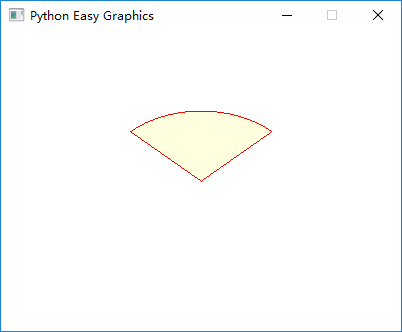

Drawing Shapes
==============

Three Types of Drawing Functions
--------------------------------

In EasyGraphics, there are three types of functions to draw shapes:

* Functions that only draw shape outlines. These functions are named like \'xxx()\' (\"xxx\" is the shape\'s name). \
  The example below draw a circle with a blue outline.

.. code:: python

    from easygraphics import *
    init_graph(200, 150)
    set_color(Color.BLUE)
    set_fill_color(Color.RED)
    circle(100, 75, 60)
    pause()
    close_graph()

* Functions that both draw and fill a shape. These functions are named like \'draw_xxx()\'(\"xxx\" is the shape\'s name).
  The example below draw a red circle with a blue outline.

.. code:: python

    from easygraphics import *
    init_graph(200, 150)
    set_color(Color.BLUE)
    set_fill_color(Color.RED)
    draw_circle(100, 75, 60)
    pause()
    close_graph()

* Functions that only fill a shape. These functions are named like \'fill_xxx()\'( \"xxx\" is the shape\'s name).
  The example below draw a red circle without outline.

.. code:: python

    from easygraphics import *
    init_graph(200, 150)
    set_color(Color.BLUE)
    set_fill_color(Color.RED)
    fill_circle(100, 75, 60)
    pause()
    close_graph()

.. list-table::
    :align: center

    * - |circle|
      - |draw_circle|
      - |fill_circle|
    * - circle()
      - draw_circle()
      - fill_circle()

.. |draw_circle| image:: ../images/graphics/draw_circle.png

Angle
-----
In easygraphics, all angles use degree as the unit.

When drawing arc,pie and chords, positive values for the angles mean counter-clockwise while negative values mean the clockwise direction. Zero degrees is at the 3 o'clock position.

The following program draws a pie from 45 degree to 135 degree.

.. code-block:: python

    init_graph(400, 300)

    set_color("red")
    set_fill_color("lightyellow")
    draw_pie(200, 150, 45, 135, 100, 70)
    pause()
    close_graph()

Polygon
-------
Use polygon()/draw_polygon()/fill_polygon(), we can draw and fill polygons.

To draw a polygon, we should specify the vertices.

polygon()/draw_polygon()/fill_polygon() expect a list as the verticis\' postions. In the list,
each vertex is represented as 2 values (x and y). So n vertices is represented by a
list with 2n values.

The following example draws a triangle with vertices at (50, 50), (350, 250), (50, 150):

.. code-block:: python

    from easygraphics import *

    init_graph(400, 300)
    set_color(Color.DARK_BLUE)
    set_fill_color(Color.LIGHT_MAGENTA)
    draw_polygon(50, 50, 350, 250, 50, 150)
    pause()
    close_graph()

Polylines
---------
Using poly_line() or draw_poly_line(), we can draw polylines.

A `polyline <https://www.webopedia.com/TERM/P/polyline.html>`_ is a continuous line composed of one or more
line segments. So to draw a polyline, we should specify the endpoints connecting each line segment.

poly_line() and draw_poly_line() expect a list as the endpoint\'s postions. In the list,
each endpoint is represented as 2 values (x and y). So n endpoints is represented by a
list with 2n values.

The following example draws a polyline connecting (50,50), (350,75), (50,150), (350,175), (50,250), (350,275).

.. code-block:: python

    from easygraphics import *

    init_graph(400, 300)
    draw_poly_line(50, 50, 350, 75, 50, 150, 350, 175, 50, 250, 350, 275)
    pause()
    close_graph()

Bézier curve
------------
`A Bézier curve <https://en.wikipedia.org/wiki/B%C3%A9zier_curve>`_ is a parametric curve that uses the Bernstein polynomials as a basis.

A Bézier curve is defined by a set of control points P0 through Pn, where n is called its order (n = 1 for linear,
2 for quadratic, 3 for cubic etc.). The first and last control points are always the end points of the curve;
however, the intermediate control points (if any) generally do not lie on the curve.

Cubic Bézier curves are the mostly used Bézier curves.

Four points P0, P1, P2 and P3 in the plane or in higher-dimensional space define a cubic Bézier curve.
The curve starts at P0 going toward P1 and arrives at P3 coming from the direction of P2. Usually,
it will not pass through P1 or P2; these points are only there to provide directional information.
The distance between P1 and P2 determines "how far" and "how fast" the curve moves towards P1 before
turning towards P2.

The explicit form of the curve is:

We can use bezier() or draw_bezier() to draw cubic Bézier curves. They expect a list as the control points\' postions.
In the list, each control point is represented as 2 values (x and y). Because a cubic Bézier curve needs 4 control
points, so there should be 8 values in the list.

The following program draw a cubic bezier curve with control points at (300,50),(200,50),(200,200) and (100,200).

.. code-block:: python

    from easygraphics import *

    init_graph(600, 400)
    points = [300, 50, 200, 50, 200, 200, 100, 200]
    draw_bezier(*points)
    pause()
    close_graph()

We can use quadratic() or draw_quadratic() to draw quadratic Bézier curves. They expect a list as the control points\' postions.
In the list, each control point is represented as 2 values (x and y). Because a quadratic Bézier curve needs 3 control
points, so there should be 6 values in the list.

The following program draw a quadratic bezier curve with control points at (300,50),(200,50),(200,200) and (100,200).

.. code-block:: python

    from easygraphics import *

    init_graph(600, 400)
    points = [300, 50, 200, 50, 200, 200, 100, 200]
    draw_bezier(*points)
    pause()
    close_graph()

Flood Fill
----------
Non-regular shapes can be filled by flood fill. The shape to be filled must be enclosed by an outline.
The follow program uses flood fill to fill a petal.

.. code-block:: python

    from easygraphics import *

    init_graph(400,200)
    set_color(Color.BLACK)
    arc(200,-40,180,360,220,220)
    arc(200,240,0,180,220,220)

    set_fill_color(Color.DARK_RED)
    flood_fill(200,100,Color.BLACK)
    pause()
    close_graph()

Below is the result:

Advanced Drawing
----------------

EasyGraphics supports drawing all the basic shape: point, line, circle, ellipse, rectangle, polygon, rectangle with
rounded corner, etc. If you need more advanced drawing, you can use Image object's get_painter() method
to get the `QPainter <http://pyqt.sourceforge.net/Docs/PyQt4/qpainter.html>`_ instance and draw.

