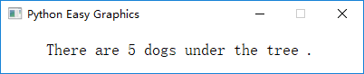
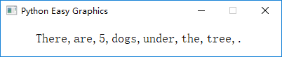
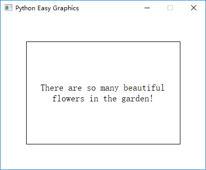

Drawing Text
============
Use draw_text() and draw_rect_text() functions, we can draw text.

These functions works like print(), you can provide many objects to draw in one function call:

.. code-block:: python

    from easygraphics import *

    def main():
        init_graph(400, 50)
        draw_text(50, 30, "There", "are", 5, "dogs", "under", "the", "tree", ".")
        pause()
        close_graph()

    easy_run(main)

Running the program above will get the follow result:

If you want to use seperators instead of space, just provide the "sep" parameter:

.. code-block:: python

    from easygraphics import *

    def main():
        init_graph(400, 50)
        draw_text(50, 30, "There", "are", 5, "dogs", "under", "the", "tree", ".", sep=",")
        pause()
        close_graph()

    easy_run(main)

The result of the above program is:

Drawing Positions
-----------------
In draw_text(), the first 2 paramenter (x,y) specify the start drawing position of the text.
This start position is left-bottom corner of the text's out border.

So the following code will draw text out of the graphics window:

.. code-block:: python

    from easygraphics import *

    def main():
        init_graph(500, 200)
        draw_text(50, 0, "Hello world!")
        pause()
        close_graph()

    easy_run(main)

Drawing Text in the Specified Rectangle
---------------------------------------
Using draw_rect_text(), we can draw a text in a bounded rectangle.

Note that the first 2 parameters (left,top) is the bounding rectangle's left-top corner,
and the 3rd and 4th parameters (width, height) is the bounding rectangle's width and height.

You can use flags to control text alignment in the rectangle.

If the bound rectangle is not big enough to enclose the whole text, the text will be clipped.

If flag "TextFlags.TEXT_WORD_WRAP" is set, the text will auto wrap if it is too long to hold in one line.

.. code-block:: python

    from easygraphics import *

    def main():
        init_graph(400, 300)
        draw_rect(50, 50, 350, 250)  # draw a border to better see the result
        draw_rect_text(50, 50, 300, 200, "There are so many beautiful flowers in the garden!",
                       flags=TextFlags.TEXT_WORD_WRAP | TextFlags.ALIGN_CENTER)
        pause()
        close_graph()

    easy_run(main)

Following is the result of the above program. Note that we use draw_rect() to draw a border around the bounding rect
to better show effect of the flags.

