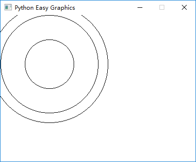
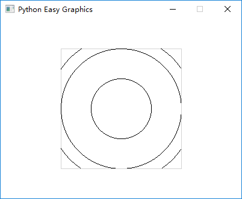
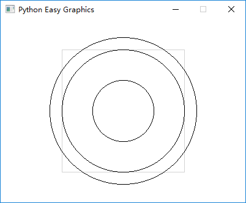
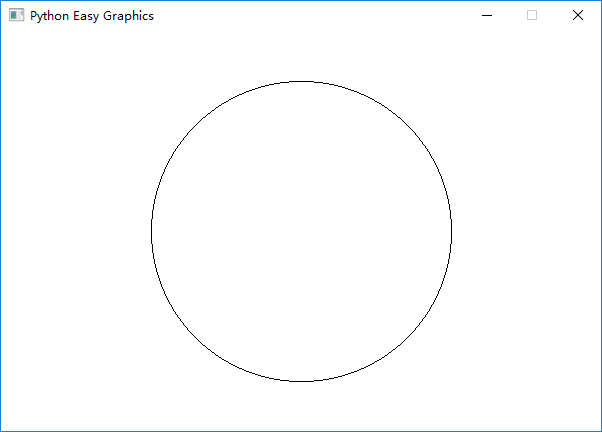

View Port and the Logical Window
================================
Normally we just paint on the whole image or window. But sometimes it will be more convenient to paint relatively in
a portion of the image. We can use view port to achieve this.

In some cases we want to zoom the painting, or set the origin to some place other than the view port\'s
top-left cornert. We can use the logical window to achieve this.

View Port
---------
View port controls which portion of the image (the graphics window) we are drawing at.

The following program draws 3 circles on the graphics window. Pay attention to their positions.

.. code-block:: python

    from easygraphics import *

    def main():
        init_graph(400, 300)
        circle(100, 100, 50)
        circle(100, 100, 100)
        circle(100, 100, 120)
        pause()
        close_graph()

    easy_run(main)

The following program set view port to the rectangle from (100,50) to (300,250), then draw 3 circles with
the code as the above programming. Compare the result with the above program. Note that we draw a border
around the view port to better see effect of the clipping.

.. code-block:: python

    from easygraphics import *

    def main():
        init_graph(400, 300)
        set_color("lightgray")
        draw_rect(100, 50, 300, 250)
        set_color("black")

        set_view_port(100, 50, 300, 250)
        circle(100, 100, 50)
        circle(100, 100, 100)
        circle(100, 100, 120)
        pause()
        close_graph()

    easy_run(main)

In the above example, all drawings outside the view port is not painted (is clipped). We can turn off
this feature by set the "clip" parameter to False:

.. code-block:: python

    from easygraphics import *

    def main():
        init_graph(400, 300)
        set_color("lightgray")
        draw_rect(100, 50, 300, 250)
        set_color("black")

        set_view_port(100, 50, 300, 250, clip=False)
        circle(100, 100, 50)
        circle(100, 100, 100)
        circle(100, 100, 120)
        pause()
        close_graph()

    easy_run(main)

The Logical Window
------------------
In easygraphics ( and the qt underlying) , there are 2 coordinates, **the logical coordinates** and
**the physical coordinates**.

**The physical coordinates** is the coordinate on the drawing device ( the graphics window or an Image object).
(0,0) is always at the device\'s top-left corner, and x-axis grows from left to right, y-axis grows from
top to bottom.

**The logical coordinates** is the coordinate we are using when specifying drawing parameters. That is,
when we call circle(50,50,100), the circle's center (50,50) is a logical coordinate.

Easygraphics will translate the logical coordinates to the physical coordinates when drawing.
By default, the logical coordinates and the physical coordinates coincide. The view port and window
will affect how the logical coordinates are translated.

`Qt's document <http://doc.qt.io/qt-5/coordsys.html#window-viewport-conversion>`_ explains how
the coordinates are translated.

The following example move the logical origin to the center, and zoom the drawing 100 times on
x and y axis:

* the default view port is 600 width, 400 height. and the window is 6 width, 4 height,
  so on x-axis we gets 600/6=100 times zoom, and on y-axis we gets 400/4=100 times zoom.
* the window is 6 width, 4 height, and we put the left-top corner at (-3,-2), so we get
  (0,0) at the center.

.. code-block:: python

    from easygraphics import *

    def main():
        init_graph(600, 400)
        set_window(-3, -2, 6, 4)

        circle(0, 0, 1.5)
        pause()
        close_graph()

    easy_run(main)

**Note:**  Obviously the logical window is difficult to understand and use. We can use :doc:`transform <009_transforms>` to
achieve the same result.