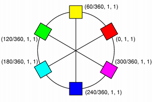
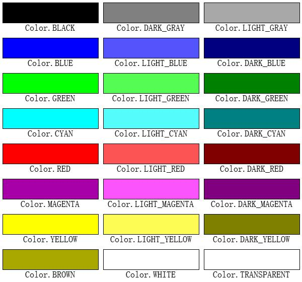

Color System
============

Color System Description
------------------------
Easy Graphics uses `Qt's Color System <http://doc.qt.io/qt-5/qcolor.html#details>`_

A color is normally specified in terms of RGB (red, green, and blue) components ( using color_rgb()),
but it is also possible to specify it in terms of HSV (hue, saturation, and value) (using color_hsv())and CMYK
(cyan, magenta, yellow and black) components (user color_cymk()).
In addition a color can be specified using a color name. The color name can be any of the SVG 1.0 color names.

.. list-table::

    * - |qcolor-rgb|
      - |qcolor-hsv|
      - |qcolor-cmyk|
    * - RGB
      - HSV
      - CMYK

.. |qcolor-rgb| image:: ../images/graphics/qcolor-rgb.png

.. |qcolor-cmyk| image:: ../images/graphics/qcolor-cmyk.png

Instead of RGB, HSV or CMYK values, A color can be set by passing an RGB string (such as "#112233"),
or an ARGB string (such as "#ff112233") or a color name (such as "blue"), use color().
The color names are taken from the `SVG 1.0 color names <https://www.w3.org/TR/SVG10/types.html#ColorKeywords>`_.

The color components can be retrieved individually, e.g with red(), hue() and cyan() member functions.
The values of the color components can also be retrieved in one go using the getRgb(),
getHsv() and getCmyk() member functions.

Using the RGB color model, the color components can in addition be accessed with rgb().

Predefined Colors
^^^^^^^^^^^^^^^^^

There are 24 predefined colors described by the Color constants.

Summary
^^^^^^^
So to set the pen's color to red , we can:

 1. Use predefined Color const

    >>> set_color(Color.RED)

 2. Use RGB values and rgb() function

    >>> set_color(color_rgb(255,0,0))

 3. Use a color name

    >>> set_color("red")

 4. Use a css web color string

    >>> set_color("#ff0000")

 5. Use a rgb integer

    >>> set_color(0xff0000)

Transparency (Alpha Value)
--------------------------
Like most morden graphic systems, Easygraphics ( and its underlying Qt System) use a alpha component to represent
the transparency of a pixel on the image. When the alpha value is 255, the pixel is fully opaque; when the alpha
value is 0, the pixel is fully tranparent.

All the color functions (color_rgb()/color_hsv()/color_cmyk()) has an optional parameter "alpha" to make a
color with transparency. The default value of this parameter is 255, which means the color is fully opaque.

You can use to_alpha() function to make a tranparency color by string or rgb integers.

The following code set the foreground color to a red with 150 as alpha value ( about half transparent)

>>> set_color(to_alpha("red",150))

