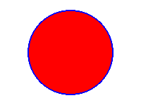

Drawing Shapes
==============

Three Types of Drawing Functions
--------------------------------

In EasyGraphics, there are three types of functions to draw shapes:

* Functions that only draw shape outlines. These functions are named like \'xxx()\' ( \"xxx\" is the shape\'s name).

The example below draw a circle with a blue outline.

.. code:: python

    from easygraphics import *
    init_graph(200, 150)
    set_color(Color.BLUE)
    set_fill_color(Color.RED)
    circle(100, 75, 60)
    pause()
    close_graph()

* Functions that both draw and fill a shape. These functions are named like \'draw_xxx()\'
( \"xxx\" is the shape\'s name).

The example below draw a red circle with a blue outline.

.. code:: python

    from easygraphics import *
    init_graph(200, 150)
    set_color(Color.BLUE)
    set_fill_color(Color.RED)
    draw_circle(100, 75, 60)
    pause()
    close_graph()

* Functions that only fill a shape. These functions are named like \'fill_xxx()\'
( \"xxx\" is the shape\'s name).

The example below draw a red circle without outline.

.. code:: python

    from easygraphics import *
    init_graph(200, 150)
    set_color(Color.BLUE)
    set_fill_color(Color.RED)
    fill_circle(100, 75, 60)
    pause()
    close_graph()

.. list-table::
    :align: center

    * - |circle|
      - |draw_circle|
      - |fill_circle|
    * - circle()
      - draw_circle()
      - fill_circle()

.. |circle| image:: ../images/graphics/circle.png

.. |fill_circle| image:: ../images/graphics/fill_circle.png

Flood Fill
----------
Non-regular shapes can be filled by flood fill. The shape to be filled must be enclosed by an outline.
The follow program uses flood fill to fill a pedal.

.. code:: python

    from easygraphics import *

    init_graph(400,200)
    set_color(Color.BLACK)
    arc(200,-40,180,360,220,220)
    arc(200,240,0,180,220,220)

    set_fill_color(Color.DARK_RED)
    flood_fill(200,100,Color.BLACK)
    pause()
    close_graph()

Advanced Drawing
----------------

EasyGraphics supports drawing all the basic shape: point, line, circle, ellipse, rectangle, polygon, rectangle with
rounded corner, etc. If you need more advanced drawing, you can use **easygraphics.Image** object's get_painter() method
to get the qpainter instance and draw.

