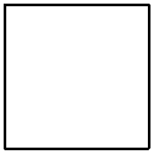

Line Styles
=====================

Using line styles, you can control how the lines and outlines are drawn.
The most useful line styles are:
    * line width
    * line shape

Line Width
----------

You can use set_line_width()/get_line_width() to get or set line width.

The following program draws a rectangle whose borders width is 10.

.. code-block:: python

    from easygraphics import *
    init_graph(400,300)
    set_line_width(10)
    draw_rect(50,50,350,250)
    pause()
    close_graph()

Predefined Line Shapes
----------------------
Using line shapes, you can draw dash line or dot line.
Use set_line_style()/get_line_style() to set line shape.

.. list-table::
    :align: center

    * - |solid_line|
      - |dash_line|
      - |dot_line|
    * - LineStyle.SOLID_LINE
      - LineStyle.DASH_LINE
      - LineStyle.DOT_LINE
    * - |dash_dot_line|
      - |dash_dot_dot_line|
      - |no_pen|
    * - LineStyle.DASH_DOT_LINE
      - LineStyle.DASH_DOT_DOT_LINE
      - LineStyle.NO_PEN

The following program draws a rectangle with dash outlines.

.. code-block:: python

    from easygraphics import *
    init_graph(400,300)
    set_line_width(10)
    set_line_style(LineStyle.DASH_LINE)
    draw_rect(50,50,350,250)
    pause()
    close_graph()

Custom Line Shapes
------------------
If predefined line shapes is not satisfying, you can set custome line shape.
To do this, you should:

1. use get_target() or create_image() to get the Image object you want to draw.
2. use the Image object\'s get_pen() to get the pen. It\'s a PyQt\'s
   `QPen <http://pyqt.sourceforge.net/Docs/PyQt4/qpen.html>`_ object.
3. Use the pen\'s `setDashPattern() <http://pyqt.sourceforge.net/Docs/PyQt4/qpen.html#setDashPattern>`_
   to set custom line shape.

.. code-block:: python

    from easygraphics import *
    init_graph(400,300)
    set_line_width(10)
    target_image=get_target()
    pen=target_image.get_pen()
    pen.setDashPattern([1,5,2,5])
    draw_rect(50,50,350,250)
    pause()
    close_graph()

More Line Styles
----------------
After getting the pen object, you can set other pen attributes to get more
line styles. See `QPen's documentation <http://pyqt.sourceforge.net/Docs/PyQt4/qpen.html>`_.

