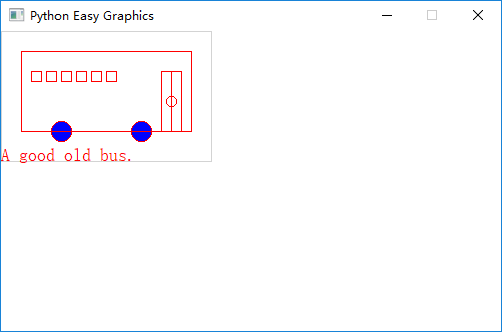
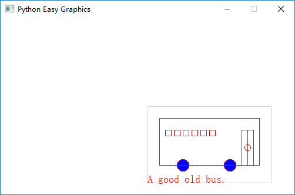
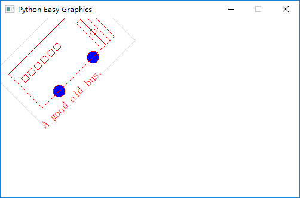
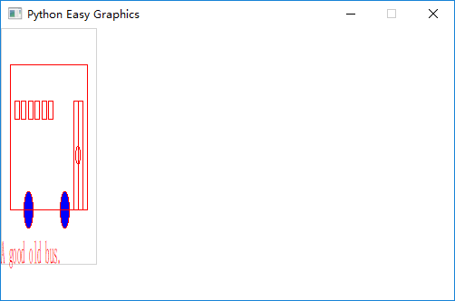
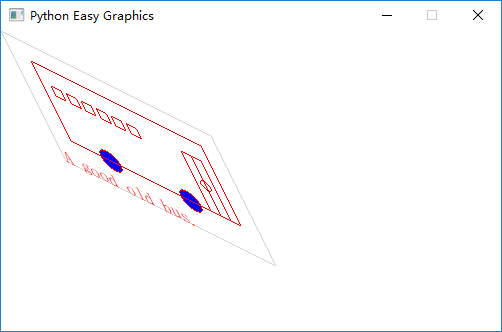
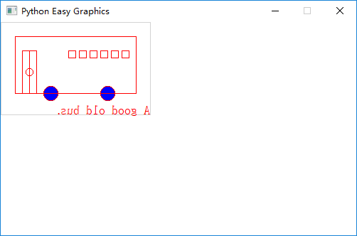

Transforms
==========
Easygraphics (and the underlying Qt system) support 5 basic coordinate transform operations:

* `Translation <https://en.wikipedia.org/wiki/Translation_(geometry)>`_: moves
  every point of a figure or a space by the same distance in a given direction.
* `Rotation <https://en.wikipedia.org/wiki/Translation_(geometry)>`_: the motion of a rigid body around a fixed point
* `Scaling <https://en.wikipedia.org/wiki/Scaling_(geometry)>`_ :enlarges (increases) or shrinks (diminishes) objects
  by a separate scale factor for each axis direction.
* `Shear Mapping(Skew) <https://en.wikipedia.org/wiki/Shear_mapping>`_ : a linear map that displaces each point in
  fixed direction, by an amount proportional to its signed distance from a line that is parallel to that direction.
* `Relection (Flipping) <https://en.wikipedia.org/wiki/Reflection_(mathematics)>`_: a transformation in geometry
  in which an object is reflected in a line to form a mirror image.

The following code draws a simple bus. We'll use it as the basis for  this chapter\'s examples.

.. code-block:: python

    def draw_bus():
        """
        Draw a simple bus
        """
        set_color("lightgray")
        rect(60, 20, 270, 150)

        set_color("red")
        set_fill_color("blue")

        draw_circle(120, 120, 10)  # draw tyre
        draw_circle(200, 120, 10)  # draw tyre
        rect(80,40,250,120)

        # draw window
        x = 90
        while x < 175 :
            rect(x, 60, x+10, 70)
            x += 15

        # draw door
        rect(220, 60, 240, 120);
        line(230, 60, 230, 120);
        circle(230, 90, 5);

The following program draws a un-transformed bus:

.. code-block:: python

    from easygraphics import *
    import draw_bus
    init_graph(500, 300)
    draw_bus.draw_bus()
    pause()
    close_graph()

Translation
-----------
Translation is the most commonly used transformation.  It moves each point by offset_x on
x-axis, and offset_y on y-axis. We use it to move the origin\'s position ( and the whole drawing).

The following program use translate() to move the origin to the center of the graphics window,
then draw the bus.

.. code-block:: python

    from easygraphics import *
    import draw_bus
    init_graph(500, 300)
    translate(250,150)
    draw_bus.draw_bus()
    pause()
    close_graph()

**Note:** set_origin() is an alias of translate()

  **Note**: Because rotation and skew are both respective to the origin, so we want rotate or skew
  around a point (x,y) other than the origin, we should:

  1. translate the origin to the (x,y)
  2. do rotate/skew
  3. translate the origin back
  4. do the drawing

Rotation
--------
Use rotate() to rotate the coordinate around the origin (0,0) clockwise.

If you need a counter-clockwise rotation, just give a negative rotation degree.

If you need to rotate around any point (x,y), just do as the above note in the translation section.

The following program draws a bus rotated 45 degree counter-clockwise around it\'s center (105,65).

.. code-block:: python

    from easygraphics import *
    import draw_bus
    init_graph(500, 300)

    # rotate around the (105,65)
    translate(105,65)
    rotate(-45)
    translate(-105,-65)

    draw_bus.draw_bus()
    pause()
    close_graph()

Scaling
-------
We can use scale() to scale the drawing in x and y axis separately.

The following program draws a x-axis shrinked and y-axis enlarged bus.

.. code-block:: python

    from easygraphics import *
    import draw_bus
    init_graph(500, 300)

    scale(0.5,2)
    draw_bus.draw_bus()

    pause()
    close_graph()

Shear Mapping (Skew)
--------------------
We use shear() or its alias skew to shear a drawing around the origin. shear() needs 2 parameters "sv" and "sh".
After shearing, each point (x,y) is transformed to (x+sh*y, y+sv*x). We can see its effect by the following examples.

Shear on X-axis
^^^^^^^^^^^^^^^
In the follow example, we shear the bus along the x-axis. Note that the default y-axis is from top to bottom.

.. code-block:: python

    from easygraphics import *
    import draw_bus
    init_graph(500, 300)

    shear(0.5,0)
    draw_bus.draw_bus()

    pause()
    close_graph()

Shear on Y-axis
^^^^^^^^^^^^^^^
In the follow example, we shear the bus along the y-axis.

.. code-block:: python

    from easygraphics import *
    import draw_bus
    init_graph(500, 300)

    shear(0,0.5)
    draw_bus.draw_bus()

    pause()
    close_graph()

Shear on both axis
^^^^^^^^^^^^^^^^^^
In the follow example, we shear the bus along the x and y-axis at the same time.

.. code-block:: python

    from easygraphics import *
    import draw_bus
    init_graph(500, 300)

    shear(0.5,0.5)
    draw_bus.draw_bus()

    pause()
    close_graph()

Reflection (Mirror, Flipping)
-----------------------------
We can use reflect() ( or its alias mirror() and flip() ) to do a reflection. It reflect the drawing again the line
passing (0,0) and its parameter (x,y).

  To reflect againt lines not passing the origin, first translate the origin to that line, reflect, then translate back.

Reflection against the y-axis
^^^^^^^^^^^^^^^^^^^^^^^^^^^^
The following program flip the bus horizontally ( reflection against the bus\'s vertical center line x=105 ) :

.. code-block:: python

    from easygraphics import *
    import draw_bus
    init_graph(500, 300)

    translate(105,0)
    reflect(0,1)
    translate(-105,0)
    draw_bus.draw_bus()
    pause()
    close_graph()

Reflection against the x-axis
^^^^^^^^^^^^^^^^^^^^^^^^^^^^
The following program flip the bus vertically ( reflection against the bus\'s horizontal center line y=65 ) :

.. code-block:: python

    from easygraphics import *
    import draw_bus
    init_graph(500, 300)

    translate(0,65)
    reflect(1,0)
    translate(0,-65)

    draw_bus.draw_bus()
    pause()
    close_graph()

Reflection against other lines
^^^^^^^^^^^^^^^^^^^^^^^^^^^^^
The following program flip the bus against the line passing (0,0) and (500,300). To clearly see the result,
we first draw a non-transformed bus, a mirror line, then draw the flipped bus.

.. code-block:: python

    from easygraphics import *
    import draw_bus
    init_graph(500, 300)

    draw_bus.draw_bus()

    set_color("gray")
    set_line_style(LineStyle.DASH_LINE)
    line(0,0,500,300)
    set_line_style(LineStyle.SOLID_LINE)

    reflect(500,300)
    draw_bus.draw_bus()
    pause()
    close_graph()

Compound Transforms
-------------------
Transforms can be compounded.

In the following example, we first translate the origin to the image center, then rotate the bus around its center,
then shear it around its center, then scale it by a factor of 1.2 .

.. code-block:: python

    from easygraphics import *
    import draw_bus
    init_graph(500, 300)

    #move the origin to the center of the image
    translate(250,150)

    # rotate around the bus center
    translate(105,65)
    rotate(180)
    translate(-105,-65)

    # shear arount the bus center
    translate(105,65)
    shear(0.5,0.5)
    translate(-105,-65)

    #scale
    scale(1.2,1.2)
    draw_bus.draw_bus()
    pause()
    close_graph()

