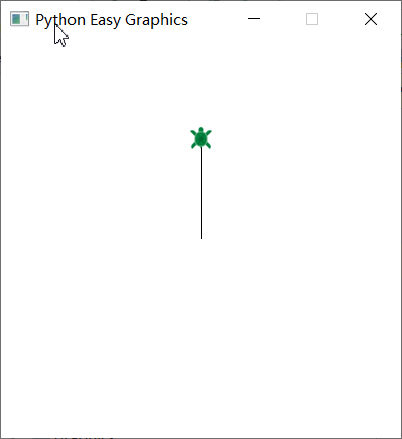
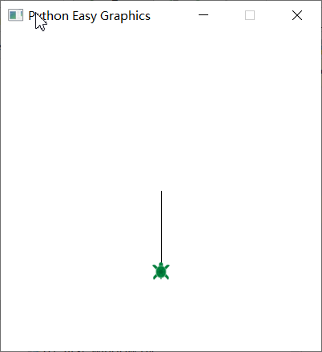
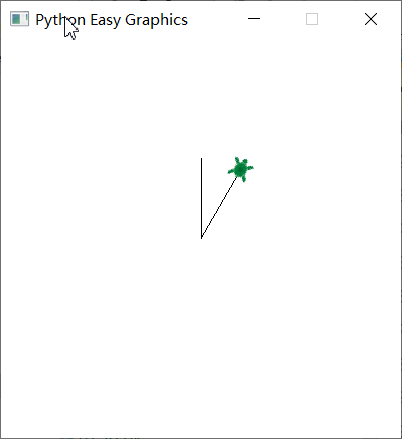
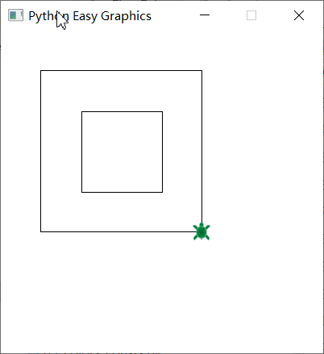
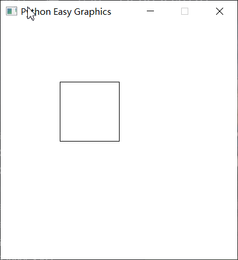

Basic Commands
================
In this tutorial, we will introduce basic commands of the turtle graphics.

Move the turtle
---------------
forward(x) function move the turtle x steps forward.
fd(x) is the short form of forward(x).

.. code-block:: python

    from easygraphics.turtle import *

    def main():
        create_world(250,250)
        fd(100)
        pause()
        close_world()

    easy_run(main)

backward(x) function move the turtle x steps backward.
back(x) and bk(x) is the short form of backward(x).

.. code-block:: python

    from easygraphics.turtle import *

    def main():
        create_world(400,400)
        bk(100)
        pause()
        close_world()

    easy_run(main)

Turning the turtle
------------------

right_turn(x) turns the turtle x degrees clockwise. right(x) and rt(x) are its short form.

left_turn(x) turns the turtle x degrees counter-clockwise. left(x) and lt(x) are its short form

The following program draws a 30 degree angle.

.. code-block:: python

    from easygraphics.turtle import *

    def main():
        create_world(400,400)
        fd(80)
        bk(80)
        rt(30)
        fd(80)
        pause()
        close_world()

    easy_run(main)

Speed of the turtle
-------------------
We can use set_speed() to control the turtle's moving speed. Speed is the more  the fast, and 1 is the slowest.
If you don't need the animation, use set_immediate(True) to disable it.

Pen Up and Pen Down
-------------------
If you want to move the turtle without a trace, you can use pen_up and pen_down.

By default the turtle is in pen down state, which means its move will leave a trace.

If the turtle is in pen up state, its move will not leave a trace.

The following program use pen up and down to draw one square inside another.

.. code-block:: python

    from easygraphics.turtle import *

    def main():
        create_world(400,400)

        # draw the inside rectangle
        for i in range(4):
            fd(100)
            lt(90)

        # use pen_up to move the turtle without a trace
        pen_up()
        rt(135)
        fd(70)
        lt(135)
        pen_down()

        # draw the outside rectangle
        for i in range(4):
            fd(200)
            lt(90)

        pause()
        close_world()

    easy_run(main)

Show and Hide the Turtle
------------------------
When the drawing is finished, we can hide() the turtle.

And show() makes the turtle visible again.

.. code-block:: python

    from easygraphics.turtle import *

    def main():
        create_world(400,400)
        for i in range(4):
            fd(100)
            lt(90)

        hide()
        pause()
        close_world()

    easy_run(main)

