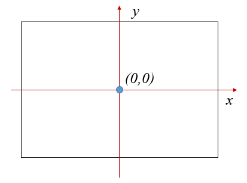
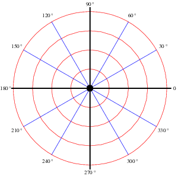

Coordinates of the Turtle World
================================

Int the turtle world, we use a coordinate system as the following:

1. The origin (0,0) is at the center of the graphics window.
2. The x axis grows from left to right.
3. The y axis grows from bottom to top.

Set the turtle's position
-------------------------

setxy(x,y) set the turtle's position to point(x,y) without a trace.

gotoxy(x,y) move the turtle to point(x,y). So if the pen is down, there will be a trace.

The turtle's heading direction will not change.

The following program demonstrated the result of gotoxy() and setxy().

.. code-block:: python

    from easygraphics.turtle import *

    def main():
        create_world(300,300)
        gotoxy(50,-100)
        for i in range(360):
            fd(1)
            lt(1)
        pause()
        cs()

        setxy(50,-100)
        for i in range(360):
            fd(1)
            lt(1)

        pause()
        close_world()

    easy_run(main)

Set the Turtle's heading
------------------------

facing(x,y) set the turtle heading to facing point(x,y).

.. code-block:: python

    from easygraphics.turtle import *

    def main():
        create_world(300,300)

        # set the turtle's heading to top-left corner of the graphics window
        facing(-150,150)
        fd(100)

        pause()
        close_world()

    easy_run(main)

set_heading(angle) set the turtle's new orientation to angle.

Values of the angles in the turtle world are as the following:

.. code-block:: python

    from easygraphics.turtle import *

    def main():
        create_world(300,300)

        # set the turtle's heading to top-left corner of the graphics window
        set_heading(30)
        fd(100)

        pause()
        close_world()

    easy_run(main)

Get turtle's current state
--------------------------

get_x() return the x coordinate value of the turtle's position.

get_y() return the y coordinate value of the turtle's position.

get_heading() return the angle value of the turtle's heading.

.. code-block:: python

    from easygraphics.turtle import *

    def main():
        create_world(300,300)

        # set the turtle heading to top-left corner of the graphics window
        facing(-150,150)
        fd(100)

        draw_text(-140, -130, "(%.2f, %.2f), heading(%.2f)" % (get_x(), get_y(), get_heading()))
        pause()
        close_world()

    easy_run(main)
