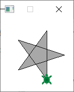
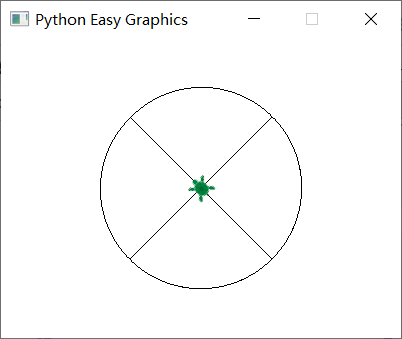
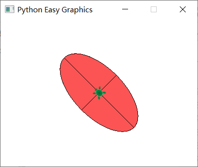
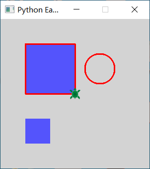

Advanced Commands
=================

Fill the drawings
-----------------

Drawings between begin_fill() and end_fill() will be filled using the fill color.
Unclosed shapes will get closed automatically.

By default the fill color is light gray. You can use easygraphics set_fill_color() to change it.

The following program draw and fill a star. Note that we use the FillRule.WINDING_FILL rule to
fill the whole star.

.. code-block:: python

    from easygraphics.turtle import *
    from easygraphics import *

    def main():
        create_world(150, 150)

        setxy(20,-50)
        set_fill_rule(FillRule.WINDING_FILL)
        begin_fill()
        for i in range(5):
            fd(100)
            lt(144)
        end_fill()

        pause()
        close_world()

    easy_run(main)

Move in arcs
------------
move_arc(radius,angle) moves the turtle in a arc path.

The center is radius units left of the turtle. That is, if radius > 0,
the center is on the left of the turtle; if radius < 0, the center is on the right of the turtle.

Angle is the value of the angle at the circle's center. If angle > 0, the turtle moves forward around the center;
if angle < 0, the turtle moves backward around the center. So:

* if angle > 0 and radius > 0, the turtle moves forward and turns counter-clockwise;
* if angle > 0 and raidus < 0, the turtle move forward and turns clockwise;
* if angle <0 and radius > 0, the turtle moves backward and turns clockwise;
* if angle <0 and radius < 0, the turtle moves backward and turns counter-clockwise.

.. code-block:: python

    from easygraphics.turtle import *

    def main():
        create_world(400, 300)
        set_speed(10)

        lt(45)

        fd(100)
        lt(90)
        move_arc(100, 90)
        lt(90)
        fd(100)
        lt(90)

        fd(100)
        rt(90)
        move_arc(-100, 90)
        rt(90)
        fd(100)
        rt(90)

        bk(100)
        rt(90)
        move_arc(100, -90)
        rt(90)
        bk(100)
        rt(90)

        bk(100)
        lt(90)
        move_arc(-100, -90)
        lt(90)
        bk(100)
        lt(90)

        pause()

        close_world()

    easy_run(main)

Move in ellipse arcs
--------------------
move_ellipse(radius_left, radius_top, angle) moves the turtle in an elliptical path.

"radius_left" is the radius of the ellipse on the direction perpendicular to the turtle's
orientation, it can be postive or negtive;"radius_top" is the radius of the ellipse
on the direction parallel to the turtle's orientation, it must be postive.

The center is radius_left units left of the turtle. That is, if radius_left > 0,
the center is on the left of the turtle; if radius_left < 0, the center is on the right of the turtle.

If angle > 0, the turtle moves forward around the center; if angle < 0, the turtle moves backward around the center. So:

* if angle > 0 and radius_left > 0, the turtle moves forward and turns counter-clockwise;
* if angle > 0 and radius_left < 0, the turtle move forward and turns clockwise;
* if angle <0 and radius_left > 0, the turtle moves backward and turns clockwise;
* if angle <0 and radius_left < 0, the turtle moves backward and turns counter-clockwise.

.. code-block:: python

    from easygraphics.turtle import *
    from easygraphics import *

    def main():
        create_world(400, 300)
        set_speed(5)

        lt(45)

        set_fill_color(Color.LIGHT_RED)
        begin_fill()
        fd(100)
        lt(90)
        move_ellipse(100, 50, 90)
        lt(90)
        fd(50)
        lt(90)
        end_fill()

        begin_fill()
        fd(100)
        rt(90)
        move_ellipse(-100, 50, 90)
        rt(90)
        fd(50)
        rt(90)
        end_fill()

        begin_fill()
        bk(100)
        rt(90)
        move_ellipse(100, 50, -90)
        rt(90)
        bk(50)
        rt(90)
        end_fill()

        begin_fill()
        bk(100)
        lt(90)
        move_ellipse(-100, 50, -90)
        lt(90)
        bk(50)
        lt(90)
        end_fill()

        pause()

        close_world()

    easy_run(main)

Use easygraphics functions
--------------------------
Most of the easygraphics functions can be used in turtle graphics.

The following program use easygraphics functions to set the line width and colors,
draw a circle, and fill a rectangle.

.. code-block:: python

    from easygraphics.turtle import *
    from easygraphics import *

    def main():
        create_world(300,300)

        set_line_width(3)
        set_color("red")
        set_background_color("lightgray")
        set_fill_color(Color.LIGHT_BLUE)

        begin_fill()
        for i in range(4):
            fd(100)
            lt(90)
        end_fill()

        circle(50,50,30)
        fill_rect(-100,-100,-50,-50)
        pause()
        close_world()

    easy_run(main)

