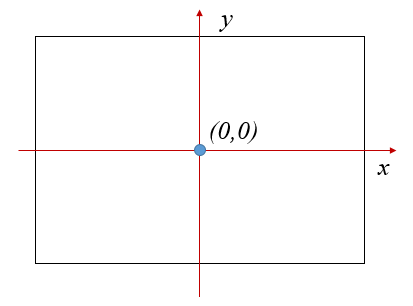

Advanced Commands
=================

In the turtle world, we use a coordinate system as the following:

1. The origin (0,0) is at the center of the graphics window.
2. The x axis grows from left to right.
3. The y axis grows from bottom to top.

Fill the drawings
-----------------

Move in arcs
------------

Move in ellipse arcs
--------------------

Use easygraphics functions
--------------------------
Most of the easygraphics functions can be used in turtle graphics.

The following program use easygraphics functions to set the line width and colors,
draw a circle, and fill a rectangle.

.. code-block:: python

    from easygraphics.turtle import *
    from easygraphics import *

    def main():
        create_world(300,300)

        set_line_width(3)
        set_color("red")
        set_background_color("lightgray")
        set_fill_color(Color.LIGHT_BLUE)

        begin_fill()
        for i in range(4):
            fd(100)
            lt(90)
        end_fill()

        circle(50,50,30)
        fill_rect(-100,-100,-50,-50)
        pause()
        close_world()

    easy_run(main)

.. image:: ../../docs/images/turtle/04_easy_funcs.png