Compositions
============
When we are drawing , what we really do is to change the destination pixels color.
Instead of just using (copy) the source color, the color be decided by both the source and the destination's
(old) color. This is where the composition modes come in.

Easygraphics (and the underlying Qt system) support three types of compositions:

* `Bit Blit <https://en.wikipedia.org/wiki/Bit_blit>`_ ( Raster Operation (ROP) / Bitwise Operation ): the source color
  and the destination color are combined using a boolean function. Both the source color and the destination color
  must be opaque.
* `Alpha compositing <https://en.wikipedia.org/wiki/Alpha_compositing>`_ : is the process of combining the source with
  the destination to create the appearance of partial or full transparency.
* `Blend <https://en.wikipedia.org/wiki/Blend_modes>`_ : is used in digital image editing and computer graphics
  to determine how two layers are blended into each other.

These three types is not strictly orthogonal, and some compositions have different names in each type.

Bit Blit (Raster Operations)
----------------------------
Bit Blit is the classic composition operation used in old graphic systems. Because it requires both the source color
and the destination color to be opaque, it's of limited use in modern graphics systems.

A classic usage of the raster operation is using bitwise XOR to draw and clear a shape, so as to create an
animation.

The following example use bitwise XOR to draw and clear the ellipse. Note that other colors will not do the job.

.. code-block:: python

    from easygraphics import *

    init_graph(400,200)
    set_background_color("white")
    x=100
    ellipse(x, 100, 100, 50) # draw a ellipse
    set_color("white")
    set_composition_mode(CompositionMode.SRC_XOR_DEST)
    while is_run():
        ellipse(x, 100, 100, 50) # clear the ellipse last drawn
        x=(x+5) % 400
        ellipse(x, 100, 100, 50) # draw a new ellipse
        delay_fps(30)

    close_graph()

Alpha Compositing
-----------------
Alpha Compositing is the mostly used composition type.

The following table shows the result of the alpha compositings.

Source and Source Over is the mostly used compistings.

.. list-table::
    :align: center

    * - Source and Destination are opaque
      - |source_o|
      - |source_over_o|
      - |source_in_o|
    * -
      - Source
      - Source Over
      - source in
    * -
      - |source_out_o|
      - |source_atop_o|
      - |xor_o|
    * -
      - source out
      - source atop
      - xor
    * -
      - |destination_o|
      - |destination_over_o|
      - |destination_in_o|
    * -
      - Destination
      - Destination Over
      - Destination in
    * -
      - |destination_out_o|
      - |destination_atop_o|
      - |xor_o|
    * -
      - Destination out
      - Destination atop
      - xor
    * - Source and Destination are partially transparent
      - |source_t|
      - |source_over_t|
      - |source_in_t|
    * -
      - Source
      - Source Over
      - source in
    * -
      - |source_out_t|
      - |source_atop_t|
      - |xor_t|
    * -
      - source out
      - source atop
      - xor
    * -
      - |destination_t|
      - |destination_over_t|
      - |destination_in_t|
    * -
      - Destination
      - Destination Over
      - Destination in
    * -
      - |destination_out_t|
      - |destination_atop_t|
      - |xor_t|
    * -
      - Destination out
      - Destination atop
      - xor

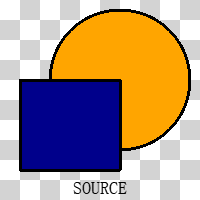
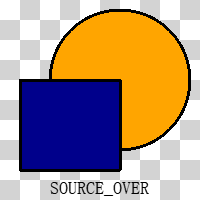

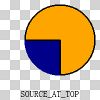
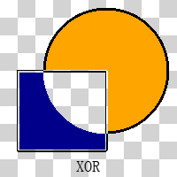
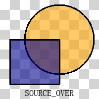
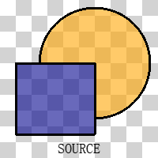
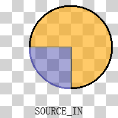
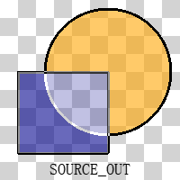
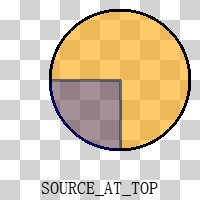
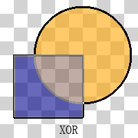
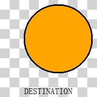
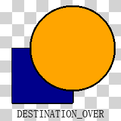
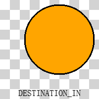
.. |destination_out_o| image:: ../images/graphics/destination_out_255.png
.. |destination_atop_o| image:: ../images/graphics/destination_at_top_255.png
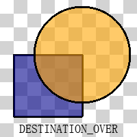
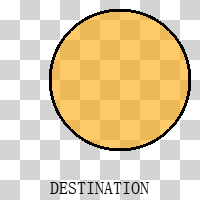
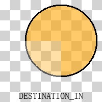
.. |destination_out_t| image:: ../images/graphics/destination_out_150.png

Blend
-----
Blend is mainly used for image or photo processing. See `wikipedia <https://en.wikipedia.org/wiki/Blend_modes>`_ for more details about it.