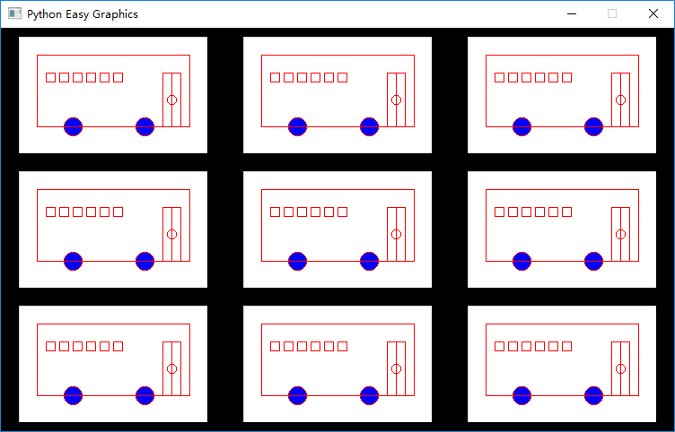
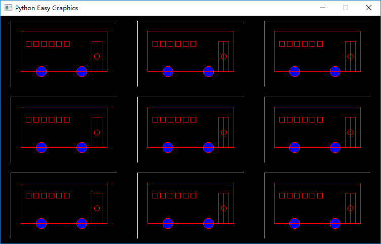
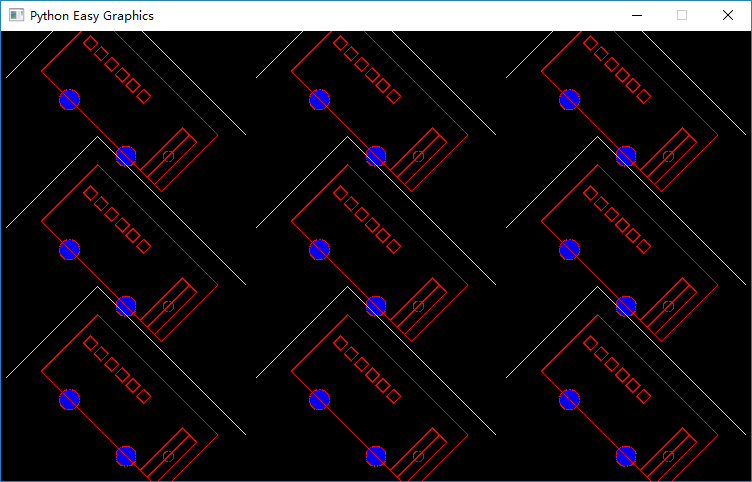

Image Processing
================

Sometimes we need to paint a complicated drawing repeatedly. It will be very cumbersome and time consuming if
we start the drawing from scratch each time. A better solution is to first draw it on a seperate image, and reuse the
image.

Create and Draw on a Image
--------------------------
Use create_image()  to create a new image instance.

There are two ways to draw on a image:

1. the OOP way: Use the image's method. The image created by create_image() is an Image object.
   we can use it's method directly.

.. code-block:: python

    img=create_image(800,600)
    img.draw_circle(100,100,50)

2. the traditional way: Use the drawing functions mentioned in the previous chapters, and provide the
   image as an additional parameter.

.. code-block:: python

    img=create_image(400,300)
    draw_circle(100,100,50,img)

The Graphics Window and The Drawing Target
------------------------------------------
In Easygraphics, the graphics window is just a special image.

To easy the coding, Easygraphics has a target image property. Most of the drawing functions has an
optional paramter "image" or "dst_image", if it's not provided, the target image will be where the
drawing happens. By default the target image is setting to the graphics window.

So you call drawing functions without specifying which image is to draw, the graphics window
will get drawn.

You can use set_target() to change the drawing target, and use get_target() to get the drawing target.

the following code use set_target() to change drawing target to a image, and draw on it:

  **Note:** Remember to use close_image() to close the unused images.

.. code-block:: python

    img=create_image(400,300)
    set_target(img)
    draw_circle(100,100,50)

Saving Image
------------
We can use save_image() to save a image to the disk.

The following program draw a bus and save it to "bus_screen.png" in the current folder.

  Note that because:

  1. By default save_image() will save the drawing target image;
  2. By default the target image is the graphics window.

  So we are saving the graphics window.

.. code-block::python

    from easygraphics import *
    import draw_bus
    init_graph(600,400)
    draw_bus.draw_bus()
    save_image("bus_screen.png")
    pause()
    close_graph()

Copy Image
----------
We can use draw_image() to copy part of one image to another image.

In the following example, we:

1. create a image and save it to variable "img"
2. set drawing target to "img"
3. draw a bus to "img" (the drawing target)
4. set drawing target back to the graphics window
5. copy the content on "img" to the graphics window's different positions.

.. code-block:: python

    from easygraphics import *
    import draw_bus

    init_graph(750,450)
    img=create_image(210,130)
    set_target(img) # set target to img
    draw_bus.draw_bus()
    set_target() # set target back to the graphics window
    set_background_color("black")
    for i in range(0,9):
        x = i % 3 * 250
        y = i // 3 * 150
        draw_image(x+20,y+10,img)

    pause()
    img.close()
    close_graph()

The result:

Image Transparency and Composition Mode
---------------------------------------
put_image() copy a rectangle area to the destination image. If you want to copy things that are not rectanglely outlined,
you can draw it on a image with fully transparent background, then copy

The following example is identical to the above example, expect that it set the source image's background to transparent
before drawing the bus.

.. code-block:: python

    from easygraphics import *
    import draw_bus

    init_graph(750,450)
    img=create_image(210,130)
    set_background_color(Color.TRANSPARENT,img) # set img's background to transparency
    set_target(img) # set target to img
    draw_bus.draw_bus()
    set_target() # set target back to the graphics window
    set_background_color("black")
    for i in range(0,9):
        x = i % 3 * 250
        y = i // 3 * 150
        draw_image(x+20,y+10,img)

    pause()
    img.close()
    close_graph()

The result is :

Copy Image without the Background
---------------------------------
If you can't draw with a transparent background, you can copy
the image without the background, by set the parameter "with_background" to False.

In the following example, we don't use a transparent backround,
and we do the copy without background.

.. code-block:: python

    from easygraphics import *
    import draw_bus

    init_graph(750,450)
    img=create_image(210,130)
    set_target(img) # set target to img
    draw_bus.draw_bus()
    set_target() # set target back to the graphics window
    set_background_color("black")
    for i in range(0,9):
        x = i % 3 * 250
        y = i // 3 * 150
        draw_image(x+20,y+10,img,with_background=False)

    pause()
    img.close()
    close_graph()

Copy Image with transforms
--------------------------
If you want to copy a image with transforms such as rotation, you should set the transforms before the copy.

The following program copy images with rotation. Note the use of save_settings() and restore_settings(), we
use it to save and restore image's transforms.

  **Note:** It's a good practice to save the old transfrom before doing any transforms before copy, and restore
  the old settings after the copy.

.. code-block:: python

    from easygraphics import *
    import draw_bus

    init_graph(750,450)
    img=create_image(210,130)
    set_target(img) # set target to img
    draw_bus.draw_bus()
    set_target() # set target back to the graphics window
    set_background_color("black")
    for i in range(0,9):
        x = i % 3 * 250 + 20
        y = i // 3 * 150 + 10
        save_settings()
        # transforms
        translate(x,y)
        translate(105,65)
        rotate(45)
        translate(-105,-65)

        draw_image(0,0,img,with_background=False)
        restore_settings()
    pause()
    img.close()
    close_graph()

Load Image
----------
We can load image from files.

  **Note:** JPEG format doesn't support transparency.
  So use the PNG format if you want to save and load image with
  transparent backgrounds.

The following example load and display a image.

.. code-block:: python

    from easygraphics import *
    init_graph(800, 600)
    img = load_image("test.png")
    draw_image((get_width() - img.get_width()) // 2,
               (get_height() - img.get_height()) // 2, img)
    pause()
    img.close()
    close_graph()

Headless Mode
-------------
Sometimes we just want to draw and save the image, and don't need to display it on
the screen. Easygraphics provides a headless mode to do the jobs. In this mode, no
graphics window is displayed, and functions for animations such as pause() won't work.

The following program shows how to use init_graph() to create a headless mode.

.. code-block:: python

    from easygraphics import *
    import draw_bus

    init_graph(headless=True)
    img=create_image(210,130)
    set_target(img)
    draw_bus.draw_bus()
    save_image("headless_bus.png")
    img.close()
    close_graph()

